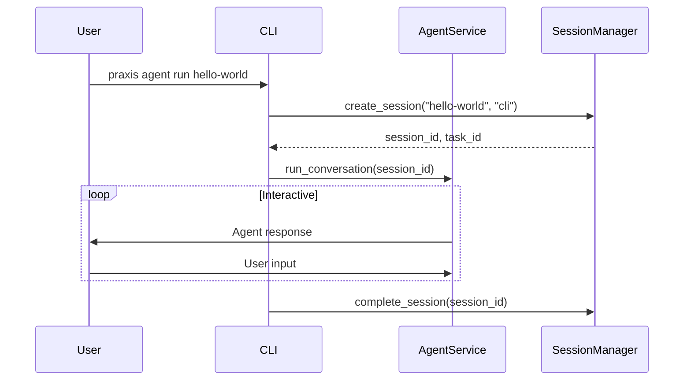
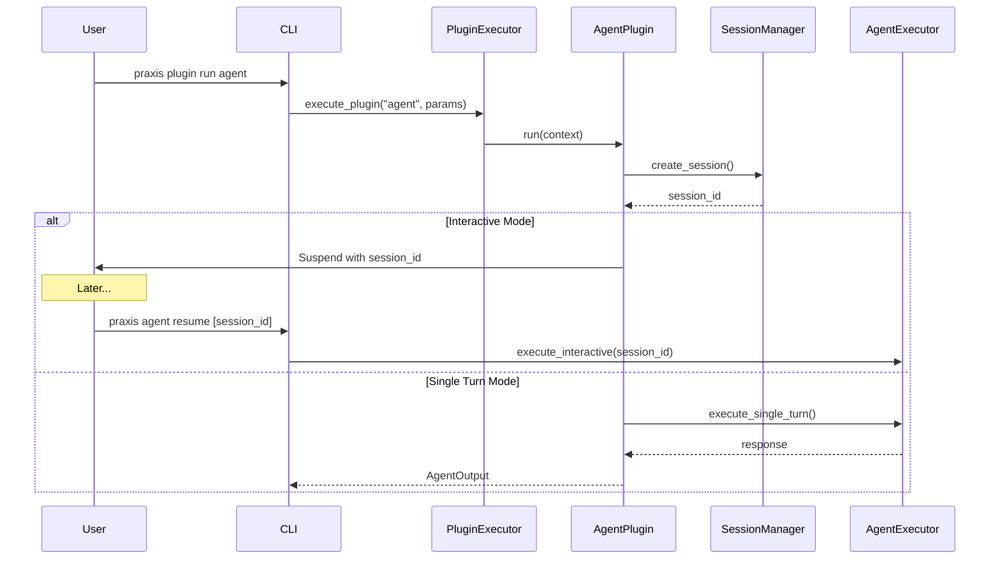
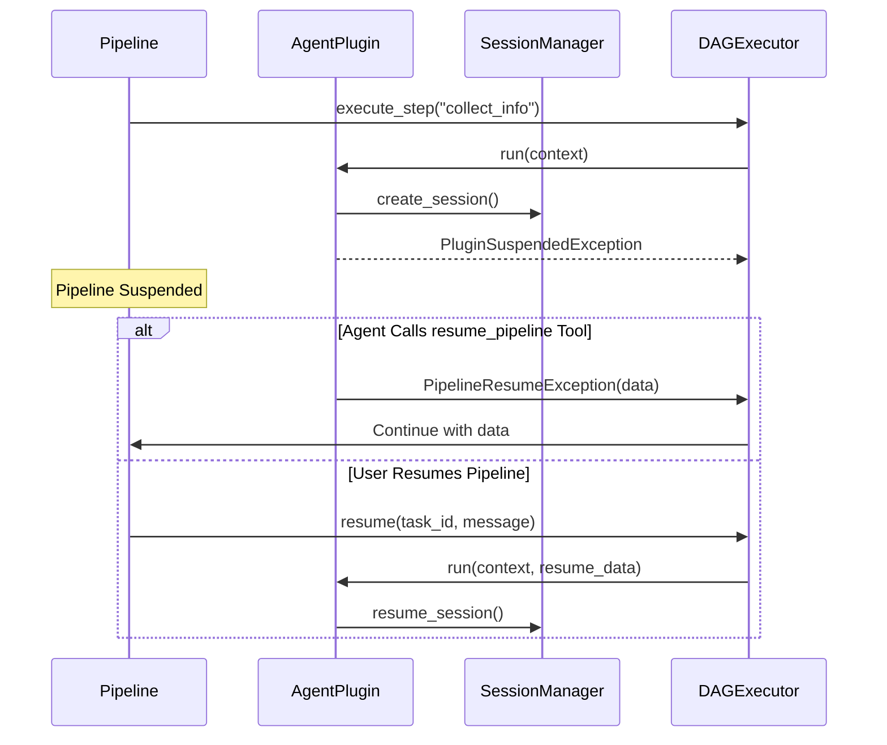
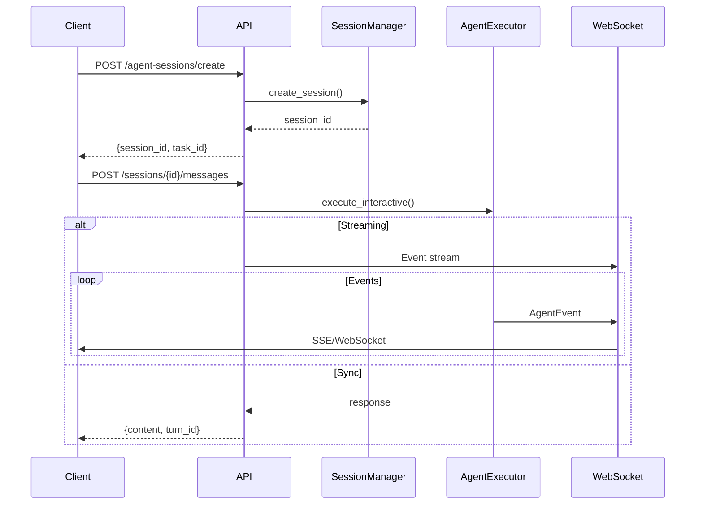

# Agent, Plugin, and Pipeline Integration Guide

## Overview

This guide explains how the unified agent session architecture integrates with agents, plugins, and pipelines across all execution modalities:

1. **Direct Agent Execution** (`praxis agent`)
2. **Plugin Execution** (`praxis plugin run agent`)
3. **Pipeline Execution** (agent as a step)
4. **API/GraphQL Execution** (REST and GraphQL endpoints)

## Core Concepts

### Session Lifecycle

```
┌─────────────┐      ┌─────────────┐      ┌─────────────┐
│   Created   │ ───► │   Active    │ ───► │ Completed   │
└─────────────┘      └─────────────┘      └─────────────┘
                            │
                            ▼
                     ┌─────────────┐
                     │  Suspended  │
                     └─────────────┘
```

Every agent interaction creates a session that:
- Has a unique session ID
- Is linked to a task ID for tracking
- Can be suspended and resumed
- Maintains full conversation history

## Execution Modalities

### 1. Direct Agent Execution

**Command**: `praxis agent run hello-world`



**Key Points**:
- Creates ephemeral session (not resumable by default)
- Direct interaction with AgentService
- No suspension unless explicitly implemented

### 2. Plugin Execution

**Command**: `praxis plugin run agent --config '{"agent_name": "hello-world", "mode": "interactive"}'`



**Key Points**:
- Plugin creates persistent session
- Interactive mode suspends immediately
- Single-turn mode completes in one execution
- Can resume via `praxis agent resume` command

### 3. Pipeline Execution

**Pipeline**: `agent-data-collection.yaml`

```yaml
name: agent-data-collection
steps:
  - name: collect_info
    plugin: agent
    config:
      agent_name: data-collector
      mode: interactive
    inputs:
      topic: "{{user_request}}"
  
  - name: process_data
    plugin: data_extract
    inputs:
      content: "{{collect_info.transcript}}"
    config:
      extraction_schema: "{{schema}}"
```



**Key Points**:
- Agent plugin suspends pipeline execution
- Session persists with pipeline checkpoint
- Two resume paths:
  1. Agent calls `resume_pipeline` tool
  2. User resumes pipeline with message
- Context maintained across suspensions

### 4. API/GraphQL Execution

**API Request**:
```bash
POST /agent-sessions/create
{
  "agent_name": "hello-world",
  "initial_message": "Help me with Python"
}
```



**Key Points**:
- Persistent sessions across API calls
- Streaming or synchronous responses
- Can hand off to other interfaces
- Full session management via REST

## Integration Scenarios

### Scenario 1: CLI to API Handoff

```bash
# Start on desktop CLI
$ praxis agent run customer-support
> Session: abc123
> Agent: How can I help you today?
> You: I need help with my order
> Agent: I'll help you with that. What's your order number?
> You: ^C  # User needs to leave

# Continue on mobile app (via API)
POST /agent-sessions/abc123/messages
{
  "message": "Order #12345"
}

# Response continues conversation
{
  "content": "I found order #12345. I see it was...",
  "session_id": "abc123"
}
```

### Scenario 2: Pipeline with Agent Interaction

```yaml
# Pipeline definition
name: customer-onboarding
steps:
  - name: gather_info
    plugin: agent
    config:
      agent_name: onboarding-assistant
      mode: interactive
      system_prompt_postfix: |
        When you have collected all required information,
        call the resume_pipeline tool with the data.
    
  - name: create_account
    plugin: account_manager
    inputs:
      user_data: "{{gather_info.collected_data}}"
```

**Execution Flow**:
1. Pipeline starts → creates session
2. Agent interacts with user
3. Agent calls `resume_pipeline(data)`
4. Pipeline continues with collected data
5. Session marked complete

### Scenario 3: Plugin Direct Execution

```bash
# Run agent plugin directly
$ praxis plugin run agent \
  --config '{"agent_name": "assistant", "mode": "single_turn"}' \
  --param topic="Explain decorators"

# Output includes session info
{
  "conversation_id": "session_xyz",
  "response": "Python decorators are...",
  "transcript": "USER: Explain decorators\nASSISTANT: Python decorators are..."
}

# Can resume if needed
$ praxis agent show-session session_xyz
$ praxis agent resume session_xyz  # If it was suspended
```

## Session Data Flow

### 1. Session Creation

```python
# All paths lead to SessionManager
session = await session_manager.create_session(
    agent_name="assistant",
    interface="cli|api|pipeline|plugin",
    task_id=task_id,  # Optional, created if not provided
)
```

### 2. Session Storage

```
artifacts/
├── agent_sessions/
│   ├── {session_id}.json        # Session metadata
│   └── ...
├── agent_checkpoints/
│   ├── {checkpoint_id}.json     # Conversation state
│   └── ...
└── {task_id}/
    ├── agent/
    │   ├── conversation_history.json
    │   └── conversation_state.json
    └── artifacts/
```

### 3. Session Resume

```python
# Resume from any interface
session, state = await session_manager.resume_session(
    session_id,
    interface="new_interface"  # Can switch interfaces
)

# State includes:
# - conversation history
# - agent configuration
# - turn count
# - metadata
```

## Configuration Examples

### Agent Plugin in Pipeline

```yaml
- name: support_agent
  plugin: agent
  config:
    agent_name: customer-support
    mode: interactive
    max_turns: 10
    system_prompt_postfix: |
      After resolving the issue, summarize and call resume_pipeline.
  inputs:
    topic: "{{customer_issue}}"
    context:
      customer_id: "{{customer_id}}"
      order_history: "{{order_history}}"
```

### Direct Plugin Config

```json
{
  "agent_name": "research-assistant",
  "mode": "single_turn",
  "mcp_servers": {
    "websearch": {
      "command": "npx",
      "args": ["-y", "@mcp/websearch"]
    }
  }
}
```

### API Session Creation

```python
# Python client example
import httpx

async with httpx.AsyncClient() as client:
    # Create session
    response = await client.post(
        "http://localhost:8000/agent-sessions/create",
        json={
            "agent_name": "assistant",
            "initial_message": "Hello",
            "metadata": {"user_id": "12345"}
        }
    )
    session = response.json()
    
    # Send message with streaming
    async with client.stream(
        "POST",
        f"/agent-sessions/{session['session_id']}/messages",
        json={"message": "Help me learn Python", "stream": True}
    ) as response:
        async for line in response.aiter_lines():
            # Handle SSE events
            print(line)
```

## Error Handling

### Session Not Found
```python
try:
    session = await session_manager.get_session("invalid_id")
except ValueError as e:
    # Handle missing session
    print(f"Session not found: {e}")
```

### Agent Not Available
```python
try:
    await executor.execute_interactive("missing-agent", "cli")
except Exception as e:
    # Agent configuration missing
    print(f"Agent error: {e}")
```

### Pipeline Suspension Timeout
```yaml
- name: agent_with_timeout
  plugin: agent
  config:
    max_turns: 5  # Prevent infinite loops
  timeout: 300  # 5 minute timeout for suspension
```

## Best Practices

### 1. Session Naming
- Use descriptive agent names
- Include purpose in metadata
- Tag sessions for easy filtering

### 2. Resource Management
- Set appropriate max_turns
- Implement session expiration
- Clean up old sessions regularly

### 3. Error Recovery
- Always handle suspension gracefully
- Provide clear resume instructions
- Log session events for debugging

### 4. Security
- Validate session ownership
- Sanitize conversation history
- Implement access controls

## Summary

The unified architecture ensures that:

1. **Every agent interaction** has a session with a task ID
2. **Sessions persist** across suspensions and interface changes
3. **History is maintained** for full conversation context
4. **Same code path** serves all execution modalities
5. **Developers have flexibility** to start simple and add features

Whether you're:
- Running an agent directly
- Using the agent plugin
- Including agents in pipelines
- Building API integrations

The session management "just works" and provides a consistent, powerful foundation for interactive AI experiences.