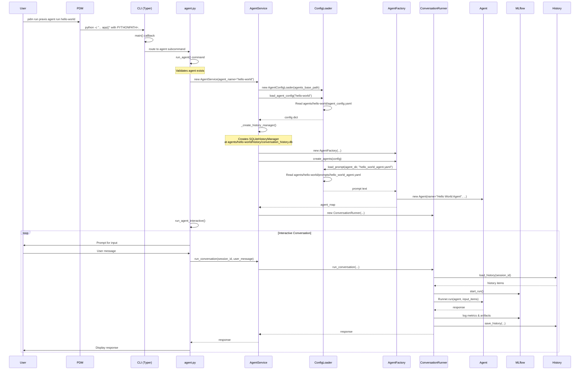

# Agent Execution Flow: `pdm run praxis agent run hello-world`

This document traces the complete execution flow when running the command `pdm run praxis agent run hello-world`.

## High-Level Overview

The command follows this general flow:
1. PDM script execution
2. CLI entry point and command parsing
3. Agent service initialization
4. Configuration loading
5. Agent creation and setup
6. Conversation loop execution
7. MLflow tracking and history management

## Detailed Flow Diagram



## Step-by-Step Execution Details

### 1. PDM Script Execution (pyproject.toml:100)
```python
praxis = {cmd = "python -c \"import sys; sys.path.insert(0, '.'); from src.cli import app; app()\"", env = {"PYTHONPATH" = "."}}
```
- PDM runs a Python command that imports and executes the CLI app
- Sets PYTHONPATH to include the current directory

### 2. CLI Entry Point (src/cli/main.py)
- Typer app is created with subcommands
- Agent subcommand is added at line 40-44:
```python
app.add_typer(
    agent.app,
    name="agent",
    help="Manage and run AI agents"
)
```

### 3. Agent CLI Command (src/cli/agent.py:227-284)
The `run` command:
- Takes optional agent_name argument ("hello-world")
- Validates the agent exists
- Calls `run_agent_interactive()` for interactive mode

### 4. Agent Service Initialization (src/services/agent_service.py:24-99)
```python
agent_service = AgentService(
    agent_name="hello-world",
    agents_base_path=Path("agents"),
    history_storage="file",  # Overridden by config to "sqlite"
    enable_mlflow=True
)
```

Key initialization steps:
1. Creates registries (ToolRegistry, GuardrailRegistry)
2. Initializes ConfigLoader and MCPServerManager
3. Loads configuration from `agents/hello-world/agent_config.yaml`
4. Creates history manager (SQLite based on config)
5. Registers MCP servers (filesystem server in this case)
6. Creates AgentFactory and builds agents
7. Creates ConversationRunner

### 5. Configuration Loading (src/services/config/agent_config_loader.py)
- Loads `agents/hello-world/agent_config.yaml`
- Key configuration:
  - default_agent_name: "Hello World Agent"
  - history_storage: "sqlite"
  - Two agents defined (Hello World Agent and Inline Prompt Agent)
  - MCP filesystem server configured

### 6. Agent Creation (src/services/agent_factory.py)
Two-pass process:
1. **First pass** (_prepare_agents_data):
   - Loads prompt from `agents/hello-world/prompts/hello_world_agent.yaml`
   - Resolves tools (web_scrape plugin)
   - Prepares agent data

2. **Second pass** (_create_agents_with_handoffs):
   - Creates Agent instances
   - Sets up handoffs between agents
   - Configures guardrails

### 7. Conversation Loop (src/cli/agent.py:98-175)
Interactive loop:
- Displays welcome message with session ID
- Prompts user for input
- Handles special commands (/help, /bye, etc.)
- Sends messages to agent service

### 8. Conversation Execution (src/services/conversation_runner.py:44-135)
For each conversation turn:
1. Loads conversation history
2. Determines current agent
3. Connects MCP servers
4. Prepares input items
5. Executes with MLflow tracking
6. Saves updated history

### 9. MLflow Tracking (src/services/conversation_runner.py:150-192)
- Creates MLflow run with descriptive name
- Logs tags: session_id, agent_name, model, tools_count
- Logs metrics: execution_time_seconds, response_length
- Saves conversation history as artifact

### 10. Agent Execution
The actual agent execution uses the `agents` library (likely the `openai-agents` package):
- `Agent` class for agent configuration
- `Runner.run()` for executing the agent
- Handles tool calls, handoffs, and conversation flow

## Key Components and Their Roles

1. **AgentService**: Main orchestrator that coordinates all components
2. **ConfigLoader**: Handles YAML configuration loading and prompt resolution
3. **AgentFactory**: Creates Agent instances from configuration
4. **ConversationRunner**: Manages conversation execution and MLflow tracking
5. **HistoryManager**: Persists conversation history (SQLite in this case)
6. **MCPServerManager**: Manages Model Context Protocol server connections
7. **ToolRegistry**: Manages available tools for agents
8. **PluginToolAdapter**: Adapts Praxis plugins to work as agent tools

## File Paths Used

- Configuration: `agents/hello-world/agent_config.yaml`
- Prompt: `agents/hello-world/prompts/hello_world_agent.yaml`
- History: `agents/hello-world/history/conversation_history.db`
- MLflow: `mlruns/` directory
- Artifacts: `agents/hello-world/artifacts/` (for plugin outputs)

## Error Handling

The system includes error handling at multiple levels:
- Agent validation in CLI
- Configuration loading errors
- Tool resolution warnings
- Conversation execution try/catch
- Graceful keyboard interrupt handling

## Session Management

- Sessions identified by UUID
- History persisted between conversations
- Can continue sessions with `--session-id` flag
- Agent state maintained across turns

This architecture provides a clean separation of concerns with dependency injection, making the system testable and extensible.