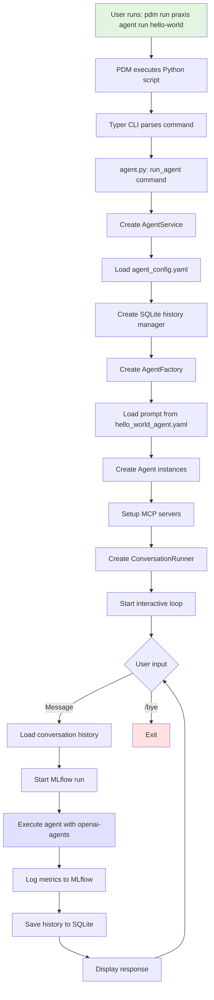

# Simplified Agent Execution Flow

## Visual Flow Diagram



## Key Execution Steps Summary

### 1. **Command Entry** 
```bash
pdm run praxis agent run hello-world
```
- PDM script injects Python path and runs CLI

### 2. **CLI Routing**
- Typer routes to agent subcommand
- Validates agent exists in `agents/` directory

### 3. **Service Initialization**
- AgentService coordinates all components
- Loads YAML configuration
- Sets up SQLite for conversation history

### 4. **Agent Creation**
- AgentFactory builds agents from config
- Loads prompts (external YAML or inline)
- Resolves tools and MCP servers

### 5. **Conversation Loop**
- Interactive prompt for user input
- Each message triggers full execution flow
- MLflow tracks metrics and artifacts
- History persisted for session continuity

### 6. **Core Dependencies**
- `openai-agents` library for agent execution
- `mlflow` for experiment tracking  
- `typer` for CLI interface
- `pydantic` for data validation

## Quick Reference Paths

| Component | File Path |
|-----------|-----------|
| Entry Point | `src/__main__.py` → `src/cli/main.py` |
| Agent CLI | `src/cli/agent.py` |
| Service Layer | `src/services/agent_service.py` |
| Config | `agents/hello-world/agent_config.yaml` |
| Prompt | `agents/hello-world/prompts/hello_world_agent.yaml` |
| History | `agents/hello-world/history/conversation_history.db` |
| MLflow | `mlruns/` |