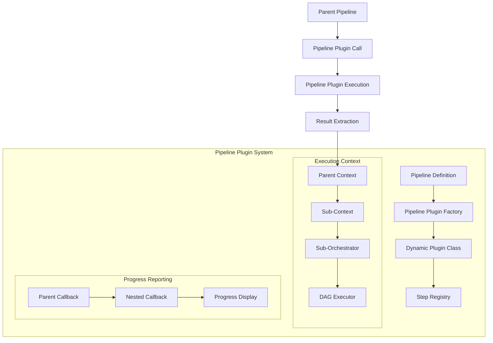
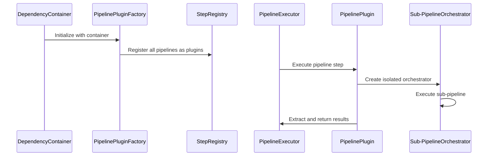
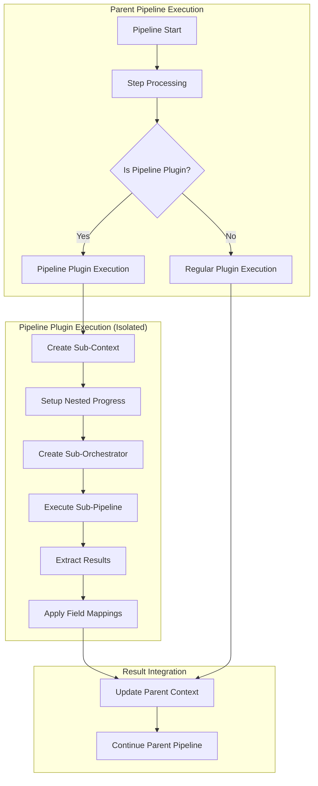

# Pipeline Plugins Architecture Guide

## Overview

The **Pipeline Plugins** feature enables the reuse of existing pipelines as individual steps within new pipelines, providing powerful composition and modularity capabilities. This document details the complete architecture, implementation, and usage of this system.

## Table of Contents

1. [Architecture Overview](#architecture-overview)
2. [Core Components](#core-components)
3. [Pipeline Plugin Naming Convention](#pipeline-plugin-naming-convention)
4. [Implementation Details](#implementation-details)
5. [Usage Examples](#usage-examples)
6. [Nested Progress Reporting](#nested-progress-reporting)
7. [Connection Resolution](#connection-resolution)
8. [Best Practices](#best-practices)

## Architecture Overview

The pipeline plugin system transforms regular pipeline definitions into reusable plugin components that can be embedded within other pipelines. This creates a hierarchical composition model where complex workflows can be built from simpler, modular pipeline components.

### High-Level Architecture



### Component Interaction Flow



## Core Components

### 1. Plugin Type System (`src/core/plugin_types.py`)

Defines the foundational type system for plugins:

```python
class PluginType(Enum):
    DEFAULT = "default"    # Standard plugin implementation
    PIPELINE = "pipeline"  # Pipeline as plugin - reusing pipelines as steps
    AGENT = "agent"        # Agent plugin - future agentic framework integration
```

**Purpose**: Provides type safety and enables different execution strategies for different plugin types.

### 2. Pipeline Plugin Class (`src/core/pipeline_plugin.py`)

The core implementation that wraps pipeline definitions as executable plugins:

```python
class PipelinePlugin(PluginBase):
    plugin_type: ClassVar[PluginType] = PluginType.PIPELINE
    
    def __init__(self, pipeline_definition: PipelineDefinition, ...):
        # Derives requirements and outputs from pipeline params
        # Sets up type descriptions for connection resolution
    
    async def run(self, context: PipelineContext) -> None:
        # Creates isolated sub-context
        # Sets up nested progress reporting
        # Executes pipeline via sub-orchestrator
        # Extracts results back to parent context
```

**Key Features**:
- **Isolation**: Creates separate execution context for sub-pipelines
- **Progress Propagation**: Maintains hierarchical progress reporting
- **Result Extraction**: Maps sub-pipeline outputs to parent context
- **Field Mapping**: Applies compatibility mappings for better plugin interoperability

### 3. Pipeline Plugin Factory (`src/core/pipeline_plugin_factory.py`)

Dynamically creates plugin classes from pipeline definitions:

```python
class PipelinePluginFactory:
    def create_pipeline_plugin_class(self, pipeline_definition) -> Type[PipelinePlugin]:
        # Creates dynamic class with unique name
        # Captures dependency container in closure
        # Returns fully configured plugin class
    
    def register_pipelines_as_plugins(self, step_registry) -> None:
        # Auto-registers all available pipelines as plugins
        # Uses "pipeline_" prefix to avoid naming conflicts
```

**Auto-Registration Process**:
1. Scans all available pipeline definitions
2. Creates dynamic plugin classes for each pipeline
3. Registers with naming convention: `pipeline_{pipeline_id}`
4. Tracks registered plugins for introspection

### 4. Dependency Container Integration (`src/core/dependency_container.py`)

Enhanced container initialization to support pipeline plugins:

```python
class DependencyContainer:
    def __init__(self, ...):
        # ... existing initialization ...
        
        # Initialize pipeline plugin factory
        self._instances[PipelinePluginFactory] = PipelinePluginFactory(self)
        
        # Auto-register all pipelines as plugins
        self._register_pipelines_as_plugins()
```

**Registration Flow**:
1. Container loads all pipeline definitions
2. Creates PipelinePluginFactory instance
3. Factory auto-registers all pipelines as plugins
4. Plugins become available for use in other pipelines

## Pipeline Plugin Naming Convention

### Automatic Plugin Registration

When a pipeline is registered as a plugin, the system automatically prefixes it with `pipeline_`:

- Pipeline ID: `youtube_basic` → Plugin Name: `pipeline_youtube_basic`
- Pipeline ID: `text_processing` → Plugin Name: `pipeline_text_processing`
- Pipeline ID: `web_scrape` → Plugin Name: `pipeline_web_scrape`

### Usage in Pipeline Definitions

```yaml
steps:
  - name: download_step
    plugin: pipeline_youtube_basic  # References youtube_basic.yaml pipeline
    depends_on: []
    
  - name: process_step
    plugin: pipeline_text_processing  # References text_processing.yaml pipeline
    depends_on: ["download_step"]
```

### Naming Rules

1. **Prefix**: All pipeline plugins use the `pipeline_` prefix
2. **ID Mapping**: The plugin name directly maps to the pipeline file: `pipeline_X` → `X.yaml`
3. **Conflict Resolution**: If a regular plugin already exists with the same name, the pipeline plugin is skipped
4. **Character Handling**: Hyphens and dots in pipeline IDs are preserved in plugin names

## Implementation Details

### System Components Added

#### 1. Type System Foundation

**File**: `src/core/plugin_types.py`
**Added**: Plugin type enumeration with three types
**Reason**: Enables different execution strategies and type safety for pipeline compositions

#### 2. Pipeline Plugin Implementation

**File**: `src/core/pipeline_plugin.py`
**Added**: Complete pipeline execution wrapper
**Key Methods**:
- `__init__()`: Derives requirements/outputs from pipeline definition
- `run()`: Orchestrates sub-pipeline execution with isolation
- `_create_sub_context()`: Creates isolated execution environment
- `_extract_results()`: Maps outputs back to parent context
- `_apply_field_mappings()`: Applies compatibility transformations

**Reason**: Provides the core functionality to execute pipelines as plugin steps with proper isolation and data flow.

#### 3. Dynamic Plugin Factory

**File**: `src/core/pipeline_plugin_factory.py`
**Added**: Factory for creating and registering pipeline plugins
**Key Methods**:
- `create_pipeline_plugin_class()`: Dynamic class generation
- `register_pipelines_as_plugins()`: Auto-registration process
- `get_registered_pipeline_plugins()`: Introspection support

**Reason**: Enables automatic discovery and registration of all pipelines as reusable plugins without manual configuration.

#### 4. Enhanced Plugin Base

**File**: `src/plugins/plugin_base.py`
**Added**: Plugin type classification support
```python
plugin_type: ClassVar[PluginType] = PluginType.DEFAULT
```


#### 5. Container Integration

**File**: `src/core/dependency_container.py`
**Added**: 
- PipelinePluginFactory initialization
- Auto-registration call in constructor
- Factory access method

**Reason**: Integrates pipeline plugin system into the dependency injection framework for seamless operation.

### Execution Flow Architecture



## Usage Examples

### Basic Pipeline Composition

**base_pipeline.yaml** (Source Pipeline):
```yaml
id: text_processing
name: Text Processing Pipeline
description: Processes text through summarization

params:
  - name: text
    required: true
    description: "Text content to process"
    type: string

steps:
  - name: summarize
    plugin: content_summarize
    depends_on: []
    fail_on_error: true
    config:
      summary_type: "key_points"
      max_length: 200
```

**composite_pipeline.yaml** (Consumer Pipeline):
```yaml
id: composite_example
name: Composite Pipeline Example
description: Uses other pipelines as steps

params:
  - name: input_text
    required: true
    description: "Initial text to process"
    type: string

steps:
  - name: first_processing
    plugin: pipeline_text_processing  # References text_processing.yaml
    depends_on: []
    fail_on_error: true

  - name: final_analysis
    plugin: content_qa
    depends_on: ["first_processing"]
    fail_on_error: false
```

### Multi-Level Nesting

```yaml
# Level 1: Base pipeline
id: text_processing
steps:
  - name: summarize
    plugin: content_summarize

# Level 2: Composite using Level 1
id: composite_level_1  
steps:
  - name: first_processing
    plugin: pipeline_text_processing
  - name: second_processing
    plugin: pipeline_text_processing
    depends_on: ["first_processing"]

# Level 3: Composite using Level 2
id: composite_level_2
steps:
  - name: deep_first
    plugin: pipeline_composite_level_1
  - name: deep_second
    plugin: pipeline_composite_level_1
    depends_on: ["deep_first"]
```

### Explicit Connection Handling

```yaml
steps:
  - name: content_extraction
    plugin: pipeline_web_scrape
    
  - name: text_summary  
    plugin: content_summarize
    depends_on: ["content_extraction"]
    connections:
      inputs:
        text: ${content_extraction.summary}  # Explicit field mapping
```

## Nested Progress Reporting

### Progress Hierarchy

The system provides hierarchical progress reporting for nested pipeline execution:

```
[1/2] ⚡ deep_first: RUNNING
  → deep_first → first_processing: RUNNING
    → first_processing → summarize: RUNNING
    ✓ first_processing → summarize: COMPLETED (8.16s)
  ✓ deep_first → first_processing: COMPLETED (8.17s)
```

### Implementation Details

1. **Callback Propagation**: Parent DAGExecutor callbacks are passed to sub-pipelines
2. **Step Prefixing**: Sub-pipeline steps are prefixed with parent step names
3. **Visual Hierarchy**: Indentation and arrows show nesting levels
4. **Status Bubbling**: Completion status propagates up through all levels

### Progress Callback Chain


## Connection Resolution

### Automatic Field Mapping

Pipeline plugins apply intelligent field mappings to improve compatibility:

```python
field_mappings = {
    'transcript': ['text'],  # transcript can be used as text
    'text': ['content'],     # text can be used as content  
    'summary': ['text'],     # summary can be used as text
    'content': ['text'],     # content can be used as text
}
```

### Output Strategy

Pipeline plugins use a multi-strategy approach for output exposure:

1. **Complete Result**: `{pipeline_id}_result` contains all outputs
2. **Prefixed Fields**: `{pipeline_id}_{field_name}` for explicit access
3. **Direct Fields**: Original field names for automatic resolution
4. **Mapped Fields**: Compatibility mappings for common field types

### Example Output Structure

For pipeline `text_processing` producing `summary`:

```python
parent_context = {
    # Complete result
    'text_processing_result': {'summary': 'Generated summary...'},
    
    # Prefixed access
    'text_processing_summary': 'Generated summary...',
    
    # Direct access (for auto-connection)
    'summary': 'Generated summary...',
    
    # Mapped access (compatibility)
    'text': 'Generated summary...'  # summary → text mapping
}
```

## Best Practices

### 1. Pipeline Design for Reusability

- **Single Responsibility**: Design pipelines to do one thing well
- **Clear Parameters**: Use descriptive parameter names and types
- **Minimal Dependencies**: Reduce external requirements for better composability
- **Standard Outputs**: Use common field names for better auto-connection

### 2. Composition Strategy

- **Layered Architecture**: Build complex pipelines from simpler ones
- **Progressive Enhancement**: Start with basic pipelines, compose into advanced workflows
- **Avoid Deep Nesting**: While supported, deep nesting can impact performance and debugging

### 3. Naming Conventions

- **Descriptive IDs**: Use clear, descriptive pipeline IDs
- **Consistent Patterns**: Follow consistent naming patterns across related pipelines
- **Avoid Conflicts**: Check for existing plugin names before creating new pipelines

### 4. Testing Approach

- **Unit Testing**: Test individual pipelines independently
- **Integration Testing**: Test pipeline compositions with real data
- **Progress Validation**: Verify nested progress reporting works correctly

### 5. Performance Considerations

- **Context Isolation**: Sub-pipelines create separate contexts, which has memory overhead
- **Progress Overhead**: Nested progress reporting adds some computational cost
- **Resource Management**: Deep nesting may require adjusted resource limits

### Migration Path

To leverage pipeline plugins in existing systems:

1. **No Changes Required**: Existing pipelines automatically become available as plugins
2. **Opt-in Usage**: Start using pipeline plugins in new composite pipelines
3. **Gradual Adoption**: Incrementally refactor complex pipelines using composition

### Future Enhancements

The system is designed to support future enhancements:

- **Agent Plugin Type**: Framework ready for agentic workflow integration
- **Output Models**: Enhanced type safety through Pydantic output models
- **Resource Optimization**: Improved efficiency for deep pipeline compositions
- **Advanced Connections**: More sophisticated data flow patterns

## Conclusion

The Pipeline Plugins architecture provides a powerful foundation for building modular, composable, and maintainable pipeline systems. By treating pipelines as reusable components, teams can build complex workflows from well-tested, single-purpose pipeline building blocks while maintaining clear separation of concerns and excellent observability through nested progress reporting. 