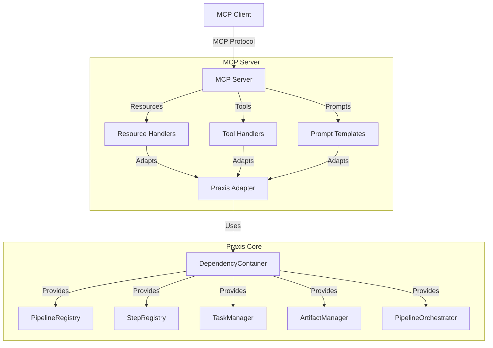

# MCP Server for Praxis: Product Requirements Document

## 1. Overview

This document outlines the requirements for implementing a Model Context Protocol (MCP) server for the Praxis platform. The MCP server will provide AI assistants with access to Praxis's pipeline execution, plugin management, and artifact handling capabilities through a standardized interface.

### 1.1 Background

Praxis is a flexible, parallelizable, DAG-driven pipeline architecture for processing various content types (videos, PDFs, web pages, etc.) through a plugin-based system. The Model Context Protocol (MCP) is an open standard that enables AI models to access external tools and data sources in a standardized way.

### 1.2 Goals

- Create an MCP server that exposes Praxis functionality through MCP's resources, tools, and prompts
- Ensure no modifications to the existing Praxis codebase are required
- Support all key Praxis capabilities (pipeline execution, plugin management, artifact access)
- Provide a clean, intuitive interface for AI assistants to interact with Praxis
- Enable incremental development with comprehensive testing

### 1.3 Target Audience

- AI assistants (like Claude) that support the MCP protocol
- Developers building applications that need to provide Praxis functionality to AI systems
- Internal tools that require standardized access to Praxis features

## 2. Requirements

### 2.1 Functional Requirements

#### MCP Resources

The server should expose the following resources:

1. **Pipeline Definitions** (`pipeline://{pipeline_id}`)
   - Resource that returns the YAML definition of a specific pipeline
   - Includes steps, parameters, and dependencies

2. **Available Pipelines** (`pipelines://list`)
   - Resource that lists all available pipelines with their IDs, names, and descriptions

3. **Plugin Information** (`plugin://{plugin_id}`)
   - Resource that returns details about a specific plugin
   - Includes input/output types, parameters, and description

4. **Available Plugins** (`plugins://list`)
   - Resource that lists all available plugins with their IDs and descriptions

5. **Task History** (`task://{task_id}`)
   - Resource that returns details about a specific task (pipeline execution)
   - Includes status, parameters, and step progress

6. **Recent Tasks** (`tasks://recent`)
   - Resource that lists recent task executions
   - Includes task IDs, pipeline IDs, statuses, and creation timestamps

7. **Task Artifacts** (`artifact://{task_id}/{artifact_name}`)
   - Resource that returns a specific artifact from a task
   - Supports different artifact types (text, JSON, binary)

#### MCP Tools

The server should expose the following tools:

1. **Run Pipeline** (`run_pipeline`)
   - Execute a pipeline with specified parameters
   - Returns a task ID for tracking

2. **Run Plugin** (`run_plugin`)
   - Execute a single plugin with specified parameters
   - Returns the plugin output

3. **Get Pipeline Status** (`get_pipeline_status`)
   - Check the status of a running pipeline
   - Returns step progress and overall status

4. **Export Task Artifacts** (`export_task_artifacts`)
   - Export artifacts from a completed task
   - Returns paths to exported files

5. **Clear Task History** (`clear_task_history`)
   - Clear task execution history
   - Returns number of cleared tasks

#### MCP Prompts

The server should provide the following prompt templates:

1. **Pipeline Parameter Prompt** (`pipeline_parameters`)
   - Guide for providing parameters for a specific pipeline
   - Dynamically generated based on pipeline definition

2. **Plugin Parameter Prompt** (`plugin_parameters`)
   - Guide for providing parameters for a specific plugin
   - Dynamically generated based on plugin requirements

3. **Task Analysis Prompt** (`task_analysis`)
   - Guide for analyzing task results and artifacts
   - Helps interpret output from a pipeline execution

### 2.2 Non-Functional Requirements

1. **Performance**
   - The MCP server should add minimal overhead to Praxis operations
   - Resource requests should complete within 500ms
   - Tool executions should match native Praxis performance

2. **Reliability**
   - Proper error handling and reporting through MCP error mechanisms
   - Graceful degradation when Praxis components are unavailable
   - Consistent behavior across different Praxis versions

3. **Security**
   - No additional attack surface beyond what's already in Praxis
   - No privileged access required beyond what Praxis needs
   - Parameter validation to prevent injection attacks

4. **Maintainability**
   - Modular code structure with clear separation of concerns
   - Comprehensive test coverage (unit, integration, e2e)
   - Clear documentation for all resources, tools, and prompts
   - Minimal dependencies on Praxis internal structures

## 3. Architecture

### 3.1 Server Components

The MCP server will be built using the following components:

1. **FastMCP Server**
   - Uses the official MCP Python SDK's FastMCP class
   - Handles protocol negotiation, message routing, and lifecycle management

2. **Praxis Adapter**
   - Bridges between MCP components and Praxis functionality
   - Uses DependencyContainer to access Praxis services
   - Translates between MCP and Praxis data structures

3. **Resource Handlers**
   - Implement resource URI templates
   - Extract data from Praxis and format for MCP responses

4. **Tool Handlers**
   - Implement tool execution logic
   - Delegate to Praxis services for actual work
   - Format results for MCP responses

5. **Prompt Templates**
   - Define reusable prompts for common interactions
   - Dynamically inject context based on user input

### 3.2 Integration Points

The MCP server integrates with Praxis through the following interfaces:

1. **DependencyContainer**
   - Central access point for all Praxis services
   - Provides registries, managers, and providers

2. **PipelineRegistry**
   - Access to pipeline definitions
   - Used by pipeline-related resources and tools

3. **StepRegistry**
   - Access to plugin definitions
   - Used by plugin-related resources and tools

4. **TaskManager**
   - Management of task execution and history
   - Used by task-related resources and tools

5. **ArtifactManager**
   - Access to task artifacts
   - Used by artifact-related resources

6. **PipelineOrchestrator**
   - Execution of pipelines
   - Used by the run_pipeline tool

### 3.3 Flow Diagrams

## 4. Implementation Plan

### 4.1 Phase 1: Minimum Viable MCP Server

**Goal**: Create a basic MCP server that can list and execute pipelines.

1. Set up the MCP server with basic resource and tool definitions
2. Implement pipeline listing and retrieval resources
3. Implement the run_pipeline tool
4. Implement task status checking
5. Create basic tests for the implemented functionality

### 4.2 Phase 2: Enhanced Pipeline and Plugin Management

**Goal**: Add comprehensive pipeline and plugin management capabilities.

1. Implement plugin-related resources and tools
2. Add artifact access resources
3. Implement the run_plugin tool
4. Extend testing coverage for new functionality

### 4.3 Phase 4: Prompt Templates and Usability Enhancements

**Goal**: Add prompt templates and usability enhancements.

1. Implement pipeline_parameters prompt
2. Implement plugin_parameters prompt
3. Implement task_analysis prompt
4. Add comprehensive documentation
5. Add end-to-end tests with real AI interactions

## 5. API Definitions

### 5.1 Resource URIs

| Resource | URI Template | Description |
|----------|--------------|-------------|
| Pipeline Definition | `pipeline://{pipeline_id}` | Get pipeline definition by ID |
| Available Pipelines | `pipelines://list` | List all available pipelines |
| Plugin Information | `plugin://{plugin_id}` | Get plugin information by ID |
| Available Plugins | `plugins://list` | List all available plugins |
| Task History | `task://{task_id}` | Get task details by ID |
| Recent Tasks | `tasks://recent` | List recent task executions |
| Task Artifacts | `artifact://{task_id}/{artifact_name}` | Get task artifact |

### 5.2 Tool Definitions

| Tool | Parameters | Returns | Description |
|------|------------|---------|-------------|
| `run_pipeline` | `pipeline_id: str, params: Dict[str, Any]` | `task_id: str` | Execute a pipeline with parameters |
| `run_plugin` | `plugin_id: str, params: Dict[str, Any]` | `output: Dict[str, Any]` | Execute a single plugin |
| `get_pipeline_status` | `task_id: str` | `status: Dict[str, Any]` | Check pipeline execution status |
| `export_task_artifacts` | `task_id: str, path: Optional[str]` | `export_path: str` | Export task artifacts to a directory |
| `generate_dynamic_pipeline` | `input_type: str, output_types: List[str]` | `pipeline_id: str` | Generate a dynamic pipeline |
| `clear_task_history` | `None` | `cleared_count: int` | Clear task execution history |

### 5.3 Prompt Templates

| Prompt | Parameters | Description |
|--------|------------|-------------|
| `pipeline_parameters` | `pipeline_id: str` | Guide for providing pipeline parameters |
| `plugin_parameters` | `plugin_id: str` | Guide for providing plugin parameters |
| `task_analysis` | `task_id: str` | Guide for analyzing task results |

## 6. Testing Strategy

### 6.1 Unit Testing

- Test each resource handler, tool handler, and prompt template independently
- Mock Praxis services to isolate MCP components
- Verify correct data transformation and error handling

### 6.2 Integration Testing

- Test MCP server with real Praxis components
- Verify correct pipeline execution, plugin execution, and artifact handling
- Test error cases and edge conditions

### 6.3 End-to-End Testing

- Test MCP server with real AI clients (e.g., Claude)
- Verify correct handling of complex workflows
- Measure performance and reliability metrics

### 6.4 Test Automation

- Set up GitHub Actions workflows for automated testing
- Use PDM for test dependencies and execution
- Generate test reports and coverage metrics

## 7. Documentation

### 7.1 User Documentation

- Guide for AI clients on using the MCP server
- Examples of common workflows (running pipelines, accessing artifacts)
- Reference for all resources, tools, and prompts

### 7.2 Developer Documentation

- Architecture overview and design decisions
- Integration guide for Praxis developers
- Contribution guidelines for MCP server development

### 7.3 API Documentation

- OpenAPI specification for HTTP transport
- Protocol documentation for stdio transport
- Sample requests and responses

## 8. Future Work

1. **WebSocket Transport**: Add support for WebSocket transport for real-time updates
2. **Streaming Results**: Add support for streaming results from long-running pipelines
3. **Authentication**: Add support for authentication and authorization
4. **Metrics and Monitoring**: Add telemetry for performance and usage monitoring
5. **Plugin Extension**: Allow plugins to register additional MCP resources and tools
6. **Multi-Pipeline Orchestration**: Allow orchestrating multiple pipelines as a workflow

## 9. Conclusion

The MCP server for Praxis will bridge the gap between AI assistants and Praxis's powerful content processing capabilities, enabling new integration scenarios and workflows. By implementing this server, we'll provide a standardized, secure, and flexible way for AI systems to leverage Praxis functionality without requiring changes to the existing codebase.

The phased implementation approach ensures we can deliver value incrementally, with a focus on quality, test coverage, and documentation. 