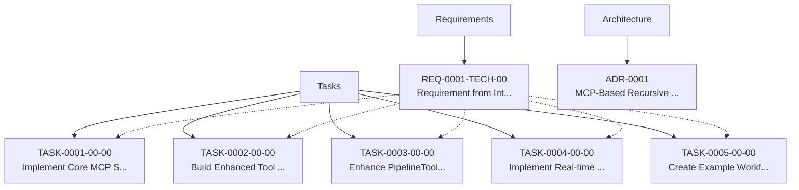

```mermaid
flowchart TD
    Requirements[Requirements]
    Tasks[Tasks]
    Architecture[Architecture]
    REQ_0001_TECH_00["REQ-0001-TECH-00<br/>Requirement from Int..."]
    Requirements --> REQ_0001_TECH_00
    TASK_0001_00_00["TASK-0001-00-00<br/>Implement Core MCP S..."]
    Tasks --> TASK_0001_00_00
    TASK_0002_00_00["TASK-0002-00-00<br/>Build Enhanced Tool ..."]
    Tasks --> TASK_0002_00_00
    TASK_0003_00_00["TASK-0003-00-00<br/>Enhance PipelineTool..."]
    Tasks --> TASK_0003_00_00
    TASK_0004_00_00["TASK-0004-00-00<br/>Implement Real-time ..."]
    Tasks --> TASK_0004_00_00
    TASK_0005_00_00["TASK-0005-00-00<br/>Create Example Workf..."]
    Tasks --> TASK_0005_00_00
    ADR_0001["ADR-0001<br/>MCP-Based Recursive ..."]
    Architecture --> ADR_0001
    REQ_0001_TECH_00 -.-> TASK_0001_00_00
    REQ_0001_TECH_00 -.-> TASK_0002_00_00
    REQ_0001_TECH_00 -.-> TASK_0003_00_00
    REQ_0001_TECH_00 -.-> TASK_0004_00_00
    REQ_0001_TECH_00 -.-> TASK_0005_00_00

```